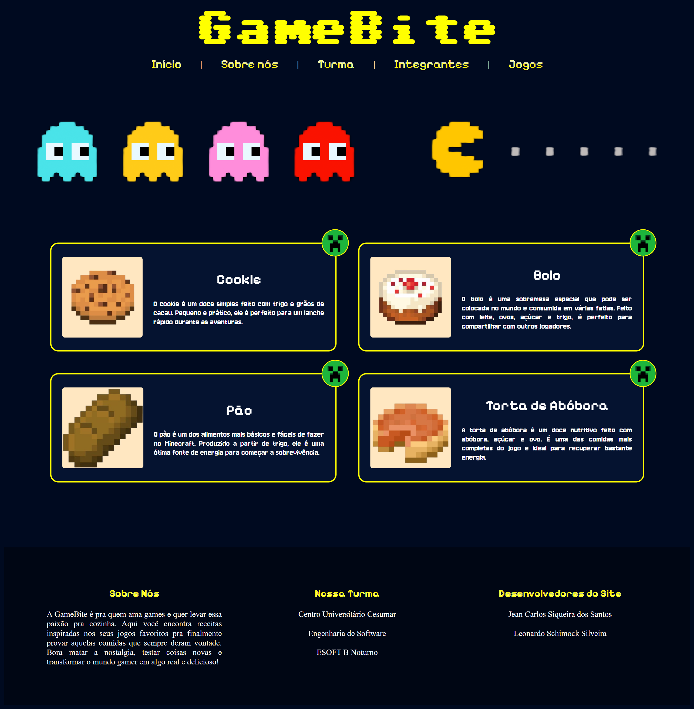
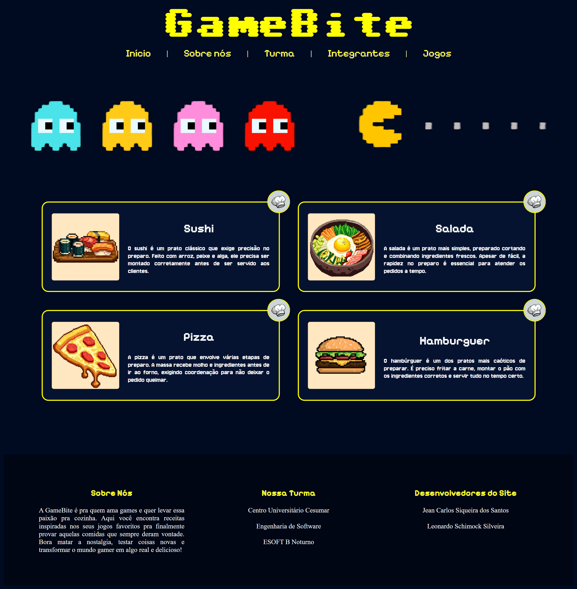
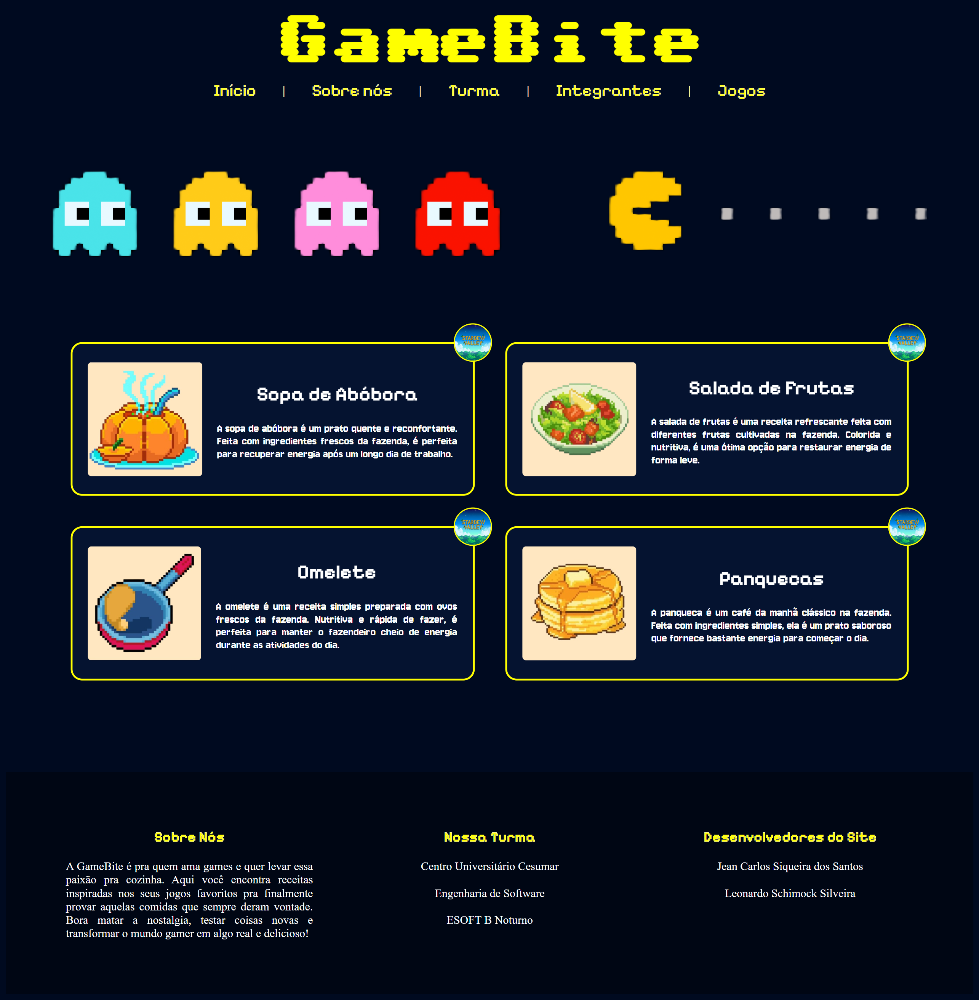

# GameBite

> Plataforma web desenvolvida em Angular para recomendação e exploração de jogos digitais, permitindo aos usuários visualizar informações, categorias e destaques de diversos títulos de forma intuitiva e organizada.

## Sumário

* [Informações Gerais](#informações-gerais)
* [Tecnologias Utilizadas](#tecnologias-utilizadas)
* [Funcionalidades](#funcionalidades)
* [Capturas de Tela](#capturas-de-tela)
* [Instalação](#instalação)
* [Utilização](#utilização)
* [Status do Projeto](#status-do-projeto)
* [Melhorias Futuras](#melhorias-futuras)
* [Contato](#contato)


## Informações Gerais

O GameBite é uma aplicação web desenvolvida como projeto acadêmico com o objetivo de aplicar conceitos de desenvolvimento Front-End utilizando Angular.

O sistema foi criado para apresentar jogos suas respectivas receitas gastronômicas de maneira organizada e atrativa, oferecendo ao usuário uma experiência semelhante à encontrada em plataformas de catálogo e recomendação de games.

### Objetivos do Projeto

* Praticar o desenvolvimento de aplicações SPA (Single Page Application).
* Aplicar conceitos de componentização utilizando Angular.
* Desenvolver uma interface moderna e responsiva.
* Trabalhar com roteamento e organização de componentes.
* Consolidar conhecimentos de HTML, CSS e TypeScript.


## Tecnologias Utilizadas

* Angular 20
* TypeScript
* HTML5
* CSS3
* Angular Router
* Git/GitHub


## Funcionalidades

Funcionalidades implementadas:

* Página inicial com destaque para jogos.
* Exibição de jogos e receitas em formato de cards.
* Navegação entre páginas utilizando Angular Router.
* Interface responsiva.
* Organização dos conteúdos por categorias.


## Capturas de Tela

<table>
  <tr>
    <td align="center">
      <br>
      <b>Home Page</b>
    </td>
    <td align="center">
      <br>
      <b>Minecraft</b>
      <br><br>
      <br>
      <b>Overcooked</b>
      <br><br>
      <br>
      <b>Stardew Valley</b>
    </td>
  </tr>
</table>


## Instalação

### Pré-requisitos

* Node.js instalado

```bash
node --version       // v24.15.0
```

* Angular CLI instalada globalmente

```bash
npm install -g @angular/cli
```

### Clonando o projeto

```bash
git clone https://github.com/leonardoschimock/gamebite-angular.git
```

### Acessando a pasta

```bash
cd gamebite-angular
```

### Instalando dependências

```bash
npm install
```

### Executando o projeto

```bash
ng serve
```

ou:

```bash
npm start
```

A aplicação estará disponível em:

```text
http://localhost:4200
```


## Utilização

Após iniciar a aplicação:

1. Acesse a página inicial.
2. Navegue pelos jogos disponíveis.
3. Explore as dos jogso disponíveis.
4. Utilize os menus de navegação para acessar as diferentes seções do site.


## Status do Projeto

Projeto: **Concluído**

O projeto foi desenvolvido para fins acadêmicos e atende aos requisitos propostos para a disciplina.


## Melhorias Futuras

### Possíveis melhorias:

* Integração com API de jogos.
* Sistema de favoritos.
* Cadastro e login de usuários.
* Filtros avançados por gênero e plataforma.
* Página individual para cada jogo.

### Próximas funcionalidades

* Implementação de banco de dados.
* Sistema de avaliações.
* Recomendações personalizadas.


## Contato

Desenvolvido por **[Leonardo Schimock](github.com/leonardoschimock) e Jean Carlos**